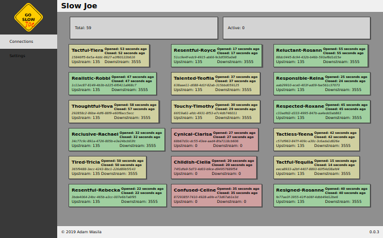

# Slow Joe

[](https://goreportcard.com/report/adamwasila/slowjoe) [](https://travis-ci.com/adamwasila/slowjoe) [](https://coveralls.io/github/adamwasila/slowjoe?branch=master)  

Simple TCP proxy to test your services for poor network conditions.

Simplicity is the most important aspect. No one wants to spend hours looking for dependencies then learning yet another DSL or quirks of config file, right? Downloading single, static binary (see [releases](../releases/latest) for that) and reading description of [few flags](#configuration) is all you need to start. Being docker aficionado makes things even simpler: all burden is to call `docker run` as [service image is available on docker hub](https://hub.docker.com/r/adamwasila/slowjoe).

> **WARNING**: unstable product. API, configuration and behaviour may and will change without a warning.

## Quick start

If docker is available it is by far the easiest way to download and run service:

```console
docker run --rm -it adamwasila/slowjoe:latest

INFO[0000] Upstream set                                  address="127.0.0.1:8000"
INFO[0000] Listen on TCP socket                          bind="127.0.0.1:9998"
```

Otherwise, go to [releases subpage](../releases/latest) and download latest version, unpack and put in your `PATH`.

Last option is to build on your own. See [Install](#install) section below for details.

Having binary in PATH you may try following examples. First, run less trivial example where `slowjoe` works as a proxy to [httpbin service](httpbin.org). Lets assume that 10% of requests should have throughput limited to 1kb/s.

```bash
slowjoe -a -u "httpbin.org:80" -t 0.1 -r 1024
```

Use `curl` to check proxy response:

```bash
curl http://localhost:9998/headers

{
  "headers": {
    "Accept": "*/*", 
    "Host": "localhost", 
    "User-Agent": "curl/7.64.0"
  }
}
```

Now hit the following link in you browser <http://localhost:9998/image/jpeg> and experience modem-like connection speed. Welcome back the Internet of 90s.

Next test closing immediately behaviour:

```bash
slowjoe -u "httpbin.org:80" -c 1.0
```

Now, all requests should be closed without sending any data.

Both behaviours may be mixed together. Here, half of connections are closed immediately and half will be throtled to 1000 bytes per second:

```bash
slowjoe -u "httpbin.org:80" -c 0.5 -t 0.5 -r 1000
```

Finally point your browser to: <http://localhost:6000> to see current settings and list of currently opened connections:



> Note: `-a` option must be set to enable web dashboard. Then `-p` may be used to set port other than default `6000`.

## Install

Go 1.13+ should be installed in the system and version 1.13 is minimal to sucessfully compile current codebase.

Download to your `GOPATH` by typing standard `go get` command:

```bash
go get -u github.com/adamwasila/slowjoe
```

Alternatively, clone this repository or download latest version. There are no official, versioned releases yet so take latest commit from the master. It opts for go modules thus sources may be put outside `GOPATH` to compile just fine using regular `go build` command. If put inside `GOPATH` remember to refer to documentation of your version of go and set `GO111MODULE` variable accordingly.

Enter repository and issue command:

```bash
go build
```

## Configuration

Help flag `-h` allows to see full configuration options:

```console
slowjoe -h

Usage of slowjoe:
  -a, --admin                   Enable admin console service
  -p, --admin-port int          Port for admin console service (default 6000)
  -b, --bind string             Address to bind listening socket to (default "0.0.0.0:9998")
  -c, --close-chance float      Probability of closing socket abruptly
  -d, --delay duration          Initial delay when connection starts to deteriorate
  -r, --rate int                Maximum data rate of bytes per second if throttling applied (see --throttle-chance)
  -t, --throttle-chance float   Probability of throttling
  -u, --upstream string         <host>[:port] of upstream service (default "127.0.0.1:8000")
  -v, --verbose                 Enable verbose output (debug logs)
  -w, --very-verbose            Enable very verbose output (trace logs)
```
